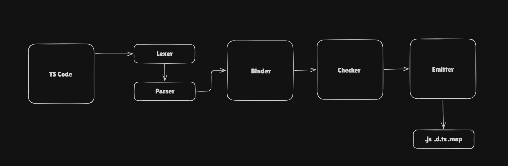

# Typescript

TypeScript adds static type checking to JavaScript, allowing us to catch type-related errors during development rather than relying entirely on JavaScript's runtime behavior.

TypeScript = JavaScript + a compile-time type system + tools for expressing and checking the structure of your program.

## How TS works?


## Type Annotations and Inference
- Annotation: I will explain (Explicitly mentioning what we will use to TS)
- Inference: You understand on your own (TS knows what type is used here based on value)

## Unions and `any`

### Union Types

A **union type** allows a variable to have multiple possible types.

We use the `|` operator to create a union.

```ts
let counting: string | number = "1 million";

counting = 100000;
```

Here, `counting` can contain either a `string` or a `number`.

```ts
counting = "1 million"; // Valid
counting = 100000;     // Valid
counting = true;       // Error
```

`boolean` is not part of the union, so TypeScript gives us an error.

---

### Literal Unions

A union can also specify the **exact values** that are allowed.

```ts
let status: "pending" | "fulfilled" | "rejected" = "pending";
```

Now `status` can only contain one of these three values:

```ts
status = "pending";
status = "fulfilled";
status = "rejected";
```

This is invalid:

```ts
status = "new"; // Error
```

because `"new"` was not included in the union.

This is useful when a variable has a fixed set of possible states.

---

### `any`

`any` is used when we **don't know what type of data we will receive or don't care about the type**.

```ts
let dataIncoming: any;
```

Now the variable can contain different types of data:

```ts
dataIncoming = "hello";
dataIncoming = 100;
dataIncoming = true;
dataIncoming = { name: "Sam" };
```

TypeScript will not complain about these assignments.

We can also access properties or call methods without TypeScript checking whether they actually exist:

```ts
let dataIncoming: any = "hello";

dataIncoming.toUpperCase();
dataIncoming.someFunction();
```

The second operation could fail at runtime, but TypeScript won't give us a type error because we told it that the value is `any`.

#### When can `any` be useful?

For example, when receiving data from an external source where we don't know the structure beforehand:

```ts
let dataIncoming: any;
```

We can then work with whatever data we receive without TypeScript forcing us to define its structure first.